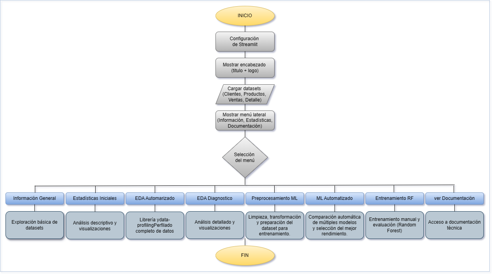

# 🛒Proyecto Tienda Aurelion – Documentación técnica

### 📚 Índice de contenidos

- [🛒Proyecto Tienda Aurelion – Documentación técnica](#proyecto-tienda-aurelion--documentación-técnica)
    - [📚 Índice de contenidos](#-índice-de-contenidos)
    - [Tema](#tema)
    - [Problema](#problema)
    - [Solución](#solución)
    - [Fuente](#fuente)
    - [Datasets: definición, columnas y tipos](#datasets-definición-columnas-y-tipos)
    - [Estructura](#estructura)
    - [Información](#información)
    - [Pasos](#pasos)
    - [Pseudocódigo](#pseudocódigo)
    - [Diagrama del flujo](#diagrama-del-flujo)
    - [Interpretaciones EDA – Visualizaciones](#interpretaciones-eda--visualizaciones)
      - [🔸 Gráfica: distribucion\_numericas](#-gráfica-distribucion_numericas)
      - [🔸 Gráfica: correlacion](#-gráfica-correlacion)
      - [🔸 Gráfica: ventas\_total\_por\_mes](#-gráfica-ventas_total_por_mes)
      - [🔸 Gráfica: relacion\_cantidad](#-gráfica-relacion_cantidad)
      - [🔸 Gráfica: outliers](#-gráfica-outliers)

---

### Tema

Análisis y consulta interactiva de datos de ventas de la Tienda Aurelion, una tienda minorista que desea comprender mejor el comportamiento de sus ventas, productos y clientes.

### Problema

La Tienda Aurelion enfrenta dificultades para mantener un equilibrio adecuado entre el stock disponible y la demanda real de los productos. Esto genera dos problemas recurrentes:

  - _Rupturas de stock_: cuando un producto se agota y no puede ser vendido.
  - _Exceso de inventario_: cuando se compran productos que permanecen sin rotación durante mucho tiempo.

Ambas situaciones impactan negativamente en la rentabilidad del negocio:

  - Las rupturas de stock reducen las ventas y afectan la satisfacción del cliente.
  - El exceso de inventario genera costos de almacenamiento innecesarios.

### Solución

Desarrollar un programa en Python y Streamlit que permita interactuar con los datos y consultar de forma sencilla información relevante. Utilizar los datos históricos de ventas, clientes y productos para:

  - Analizar la demanda real de cada producto.
  - Identificar los productos de mayor y menor rotación.
  - Estimar la demanda futura promedio mensual.
  - Proporcionar información visual que ayude a tomar decisiones de compra y reposición más inteligentes.

**Análisis que se puede realizar**

1. Ventas totales por producto y mes.
2. Ranking de productos más vendidos.
3. Relación entre stock disponible y ventas promedio.
4. Productos con ventas decrecientes (riesgo de exceso de stock).
5. Productos con ventas crecientes (riesgo de ruptura de stock).
6. Predicción de demanda promedio mediante una regresión lineal simple.

**Resultado esperado**

Una aplicación en Streamlit que permita:

   - Visualizar métricas de ventas y rotación.
   - Detectar los productos críticos para reposición.
   - Consultar la documentación del proyecto.

### Fuente

Su origen es secundario, los datasets fueron provistos por Guayerd dentro del programa de Fundamentos de Inteligencia Artificial que desarrolla junto a IBM.

_Nota_: Estos datasets son de carácter didáctico y se proporcionan solo con fines de prueba y aprendizaje, para poder estudiar y practicar el análisis de datos y la implementación de modelos.

### Datasets: definición, columnas y tipos

| Dataset | Descripción breve | Columnas | Tipo / Escala |
|----------|------------------|-----------|----------------|
| **clientes.xlsx** | Información de los clientes | id_cliente<br>nombre_cliente<br>email<br>ciudad<br>fecha_alta | int64 (Razón)<br>object (Nominal)<br>object (Nominal)<br>object (Nominal)<br>datetime64 (Intervalo) |
| **productos.xlsx** | Información de los productos | id_producto<br>nombre_producto<br>categoria<br>precio_unitario | int64 (Razón)<br>object (Nominal)<br>object (Nominal)<br>int64 (Razón) |
| **ventas.xlsx** | Registro de cada venta realizada | id_venta<br>fecha<br>id_cliente<br>nombre_cliente<br>email<br>medio_pago | int64 (Razón)<br>datetime64 (Intervalo)<br>int64 (Razón)<br>object (Nominal)<br>object (Nominal)<br>object (Nominal) |
| **detalle_ventas.xlsx** | Detalle de cada producto vendido | id_venta<br>id_producto<br>nombre_producto<br>cantidad<br>precio_unitario<br>importe | int64 (Razón)<br>int64 (Razón)<br>object (Nominal)<br>int64 (Razón)<br>int64 (Razón)<br>int64 (Razón) |

**Comentarios:**

- **PK (Primary Key):** identificador único de cada registro.  
- **FK (Foreign Key):** columna que referencia la PK de otro dataset.  
- `id_cliente`, `id_producto` y `id_venta` son **PK** en sus respectivas tablas.  
- `ventas.id_cliente` referencia a `clientes.id_cliente`.  
- `detalle_ventas.id_venta` referencia a `ventas.id_venta`.  
- `detalle_ventas.id_producto` referencia a `productos.id_producto`.  

### Estructura

Cada dataset es estructurado; se organiza en filas que representan registros individuales y columnas que representan atributos de interés para el análisis. Contienen datos tanto cuantitativos como cualitativos. Todos ellos en formato .xlsx (Excel).

### Información

1. **Nombre del programa:** Proyecto Tienda Aurelion

2. **Objetivo:**
   Permitir la exploración interactiva de los datos de ventas, clientes y productos de la tienda, proporcionados en los siguientes dataset:
   - `clientes.xlsx`
   - `productos.xlsx`
   - `ventas.xlsx` 
   - `detalle_ventas.xlsx`
   
   Estos archivos fueron unificados en un único dataset integrado denominado `df_tienda_aurelion.csv`, que concentra toda la información relevante para su análisis. 
   
   Además, la aplicación muestra la documentación, el pseudocódigo y los diagramas de flujo del proyecto.

3. **Lenguaje y librerías utilizadas**
    - `Python 3.11`
    - Librerías: `streamlit`, `pandas`, `PIL` (para imágenes), `os` (gestión de archivos), `matplotlib`, `seaborn`, `numpy`, `pathlib`, `ydata-profiling` (para realizar un EDA automatizado), `streamlit-pandas-profiling`

4. **Entrada de datos**
    - Archivos Excel: `clientes.xlsx`, `productos.xlsx`, `ventas.xlsx`, `detalle_ventas.xlsx`
    - Archivo de documentación: `documentacion_tienda_aurelion.md`

5. **Salida / Visualización**
    - Interfaz web interactiva con menú lateral
    - Expanders utilizados en la sección Ver documentación para mostrar de forma organizada el contenido técnico (contexto, datasets, metodología, pseudocódigo y diagrama de flujo).
    - Tablas de datos y resúmenes estadísticos

6. **Funcionalidades principales**
    - **Información General**: Vista previa de cada dataset, tipos de datos, metadatos y estadísticas básicas.
    - **Estadísticas Descriptivas**: Análisis detallado mediante `pandas.describe(include="all")` con visualizaciones personalizadas:
      - Distribución de variables numéricas y categóricas
      - Matrices de correlación
      - Gráficos específicos por dataset (series temporales, distribuciones, etc.)
    - **EDA Automatizado**: Análisis exploratorio completo utilizando `ydata-profiling`:
      - Perfilado automático de variables
      - Detección de correlaciones y patrones
      - Análisis de valores faltantes y cardinalidad
    - **EDA Diagnóstico**: Análisis en profundidad del dataset unificado:
      - Limpieza y preparación de datos
      - Detección y análisis de outliers
      - Visualizaciones avanzadas de series temporales
      - Identificación de productos top y patrones de venta
    - **Documentación Interactiva**: Acceso organizado a la documentación técnica del proyecto
    - **Exportación de Visualizaciones**: Guardado automático de gráficos en la carpeta `assets/plots`

7. **Estructura del programa**
    - **Carga y Unificación**: 
      - Función `load_dataset()` con caché de Streamlit
      - Generación automática del dataset unificado mediante `load_and_merge_datasets()`
    - **Menú Principal**: Radio buttons en la barra lateral con las opciones:
      - Información General
      - Estadísticas
      - EDA Automatizado
      - EDA Diagnóstico
      - Ver Documentación
    - **Módulos Organizados**:
      - Cargadores de datos (`data_loader.py`)
      - Páginas separadas por funcionalidad (`pages/`)
      - Utilidades de visualización (`utils/`)

### Pasos

1. **Inicio de la aplicación**  
   - Se inicializa Streamlit y se configura la página (título, ícono y diseño).  
   - Se muestra el logotipo de la tienda junto al encabezado principal de la interfaz.

2. **Carga de datasets**  
   - Se leen los archivos Excel: `clientes.xlsx`, `productos.xlsx`, `ventas.xlsx` y `detalle_ventas.xlsx` mediante **pandas**.  
   - Cada archivo se carga en un **DataFrame** independiente.  
   - La función de carga se **almacena en caché** (`st.cache_data`) para optimizar el rendimiento y evitar recargas innecesarias.

3. **Menú principal**  
   - Se implementa mediante radio buttons en la barra lateral, ofreciendo cinco secciones principales:
     - **Información General**: Exploración básica de datasets
     - **Estadísticas**: Análisis descriptivo y visualizaciones
     - **EDA Automatizado**: Perfilado completo de datos
     - **EDA Diagnóstico**: Análisis detallado y visualizaciones
     - **Ver Documentación**: Acceso a documentación técnica

4. **Opción 1: Información General**  
   - Interfaz de selección de dataset mediante selectbox
   - Para cada archivo seleccionado muestra:
     - Metadatos: fecha de modificación y tamaño
     - Vista previa de registros mediante `head()`
     - Estructura detallada: tipos de datos y columnas
     - Resumen: dimensiones y cantidad de registros
   - Información organizada en expanders para mejor navegación

5. **Opción 2: Estadísticas**  
   - Selección interactiva del dataset a analizar
   - Análisis estadístico completo que incluye:
     - Estadísticas descriptivas via `describe(include="all")`
     - Análisis de valores nulos y únicos
     - Visualizaciones específicas según tipo de datos:
       • Variables numéricas: histogramas y boxplots
       • Variables categóricas: gráficos de barras y pie
       • Series temporales: evolución y tendencias

6. **Opción 3: EDA Automatizado**
   - Generación automática del dataset unificado si no existe
   - Creación de un reporte interactivo completo usando `ydata-profiling`
   - Visualización integrada mediante `streamlit-pandas-profiling`
   - Análisis automático de:
     • Distribuciones y estadísticas
     • Correlaciones entre variables
     • Valores faltantes y duplicados
     • Alertas y recomendaciones

7. **Opción 4: EDA Diagnóstico**
   - Análisis profundo del dataset unificado
   - Proceso de limpieza y preparación de datos
   - Generación de visualizaciones avanzadas:
     • Matrices de correlación
     • Series temporales de ventas
     • Análisis de outliers
     • Rankings y patrones de venta
   - Guardado automático de gráficos en `assets/plots`

8. **Opción 5: Ver Documentación**  
   - Lectura y procesamiento de `documentacion_tienda_aurelion.md`
   - Contenido organizado en expanders por secciones:
     • Contexto y objetivo
     • Datasets y metodología
     • Pseudocódigo
     • Diagrama de flujo
   - Visualización adaptativa del flujograma

7. **Interactividad**  
   - Los **expanders** permiten ocultar o desplegar secciones para una interfaz más limpia.  
   - Los **selectboxes** ofrecen navegación dinámica entre datasets y apartados.  
   - La aplicación combina usabilidad y claridad visual para una exploración fluida de los datos.

### Pseudocódigo

```text
INICIO

1. Configurar la página de Streamlit:
    - Título: "Tienda Aurelion"
    - Ícono de la página
    - Layout: ancho completo ("wide")

2. Mostrar encabezado principal:
    - Crear dos columnas (1 y 4 proporciones)
    - Columna 1: mostrar logo de la tienda desde ./assets/logo_aurelion.png
    - Columna 2: mostrar título del proyecto y descripción general

3. Definir funciones de carga y unificación:
    FUNCION get_dataset_paths():
        Retornar diccionario con rutas de:
            - clientes.xlsx
            - productos.xlsx
            - ventas.xlsx
            - detalle_ventas.xlsx
            - df_tienda_aurelion.csv

    FUNCION load_dataset(nombre):
        - Obtener rutas mediante get_dataset_paths()
        - SI nombre es "df_tienda_aurelion" y no existe:
            Llamar a load_and_merge_datasets()
        - SI es archivo Excel:
            Leer con pandas.read_excel()
        - SI es archivo CSV:
            Leer con pandas.read_csv()
        - Manejar errores y mostrar advertencias

    FUNCION load_and_merge_datasets():
        - Cargar los 4 datasets Excel
        - Realizar merge progresivo:
            1. clientes + ventas
            2. ventas + clientes
            3. detalle_ventas + productos
            4. merge final
        - Calcular total_venta y convertir fechas
        - Guardar como CSV
        - Retornar DataFrame unificado

4. Definir utilidades de visualización:
    FUNCION save_fig_to_disk(figura, nombre, carpeta="assets/plots"):
        - Crear carpeta si no existe
        - Limpiar nombre del archivo
        - Guardar figura con calidad apropiada

    FUNCION mostrar_fig(figura, ancho=700):
        - Mostrar en Streamlit
        - Opcionalmente guardar en disco
        - Cerrar figura

5. Crear menú lateral con opciones:
    - "Información general"
    - "Estadísticas"
    - "EDA Automatizado"
    - "EDA Diagnóstico" 
    - "Ver documentación"

6. SI la opción es "Información general":
    - Mostrar selectbox con datasets disponibles
    - Para el dataset seleccionado mostrar:
        - Fecha y tamaño del archivo
        - Vista previa (head)
        - Estructura (tipos de columnas)
        - Cantidad de registros

7. SI la opción es "Estadísticas":
    - Permitir seleccionar dataset
    - Mostrar:
        - Información general del dataset
        - Valores nulos por columna
        - Valores únicos por columna
        - Estadísticas descriptivas
        - Matriz de correlación (si hay numéricas)
        - Visualizaciones específicas según el dataset:
            • Clientes: distribución por ciudad y mes
            • Productos: distribución de precios y categorías
            • Ventas: evolución mensual y medios de pago
            • Detalle: distribución de cantidades e importes

8. SI la opción es "EDA Automatizado":
    - Cargar/generar df_tienda_aurelion
    - Crear ProfileReport con ydata-profiling
    - Mostrar en Streamlit con st_profile_report

9. SI la opción es "EDA Diagnóstico":
    - Cargar df_tienda_aurelion
    - Verificar unificación exitosa
    - Realizar limpieza básica:
        • Convertir fechas a datetime
        • Renombrar columnas si necesario
        • Eliminar columnas duplicadas
    - Generar y guardar visualizaciones:
        • Distribución de variables numéricas
        • Matriz de correlación
        • Series temporales de ventas
        • Top productos
        • Detección de outliers
    - Mostrar interpretación de resultados

10. SI la opción es "Ver documentación":
    - Verificar existencia de documentacion_tienda_aurelion.md
    - SI existe:
        - Leer contenido y dividir en secciones
        - Mostrar cada sección en expander
        - Mostrar diagrama de flujo centrado
    - SINO:
        - Mostrar advertencia

11. Mostrar pie de página (footer):
    - Información del Sprint
    - Autor y enlace a LinkedIn

FIN

```

### Diagrama del flujo

A continuación, se presenta el flujograma del proceso general del proyecto **Tienda Aurelion**.  
Este diagrama ilustra las principales etapas del flujo del programa, desde la carga de los datasets hasta la visualización interactiva de la información en la aplicación web.

<p align="center">
  
</p>


### Interpretaciones EDA – Visualizaciones

Esta sección describe las principales visualizaciones generadas automáticamente por la aplicación, junto con su interpretación.
Cada gráfico se encuentra guardado en la carpeta plots/ y se muestra en la sección de estadísticas del dashboard.

#### 🔸 Gráfica: distribucion_numericas

A continuación, se detallan las explicaciones correspondientes a cada una de las variables analizadas.

| Variable            | Descripción visual                                                  | Patrón observado                                                                                                                                             | Interpretación                                                                                                               |
| ------------------- | ------------------------------------------------------------------- | ------------------------------------------------------------------------------------------------------------------------------------------------------------ | ----------------------------------------------------------------------------------------------------------------------------- |
| **cantidad**        | Eje X: cantidad (1 a 5) <br> Eje Y: frecuencia (hasta ~85)          | • Las cantidades más frecuentes son 2 y 4, con picos cercanos a 80 y 70 respectivamente. <br> • Las demás cantidades (1, 3 y 5) tienen frecuencias similares, alrededor de 60. | Distribución discreta y relativamente uniforme, con un pico notable en **cantidad = 2**. La dispersión es baja.               |
| **precio_unitario** | Eje X: precio_unitario (0 a 5000) <br> Eje Y: frecuencia (hasta 60) | • Asimétrica, con concentración entre **1500 y 2500**. <br> • Pico cerca de **2000**. <br> • Pocos valores en extremos (<500 y >4000).                       | La mayoría de los productos se venden en un rango medio de precios, con pocos productos en rangos muy altos.         |
| **total_venta**     | Eje X: total_venta (0 a 25000) <br> Eje Y: frecuencia (hasta 60)    | • Distribución **sesgada a la derecha**. <br> • Alta concentración entre **0 y 10,000**, con pico entre **3,000–5,000**. <br> • Pocos casos >20,000.         | La mayoría de las ventas son bajas o moderadas; las muy altas son raras, indicando posibles *outliers* en el extremo derecho. |


#### 🔸 Gráfica: correlacion

**Variables analizadas:**
* cantidad
* precio_unitario
* total_venta

**Principales resultados:**
1. cantidad vs precio_unitario
- Correlación: -0.074 (muy baja y negativa). No existe relación significativa entre la cantidad vendida y el precio unitario. Es decir, vender más unidades no implica que el precio sea mayor o menor.

2. cantidad vs total_venta:
- Correlación: 0.6 (moderada y positiva). A mayor cantidad, tiende a aumentar el total de venta, lo cual es lógico porque más unidades generan más ingresos, aunque no es una relación perfecta.

3. precio_unitario vs total_venta:
- Correlación: 0.68 (moderada-alta y positiva). El precio unitario tiene una influencia importante en el total de venta. Productos más caros tienden a generar ventas totales más altas, incluso si la cantidad no varía mucho.

#### 🔸 Gráfica: ventas_total_por_mes

El gráfico muestra la evolución de las ventas mensuales entre enero 2024 y junio 2024.
Se observa una tendencia fluctuante, con una caída marcada en abril y una recuperación fuerte en mayo.

Resultados clave:

* **Máximo**
  - Mes: mayo 2024 - Valor: 561,832
  - Este fue el mejor mes en ventas, superando el promedio por un amplio margen.

* **Mínimo**
  - Mes: abril 2024 - Valor: 251,524
  - Abril fue el peor mes, con ventas muy por debajo del promedio.

* **Promedio**
  - Línea horizontal: 441,903 
  - Tres meses (enero, mayo y junio) estuvieron por encima del promedio, mientras que febrero, marzo y abril quedaron por debajo.

Tendencias específicas:
- Enero (529,840): Buen inicio, por encima del promedio.
- Febrero y Marzo: Descenso progresivo (407,041 → 388,263).
- Abril: Caída abrupta al mínimo (251,524).
- Mayo: Recuperación fuerte al máximo (561,832).
- Junio: Ligera baja respecto a mayo, pero sigue alto (512,917).

> Las ventas son volátiles, con un mínimo crítico en abril y un máximo en mayo.
El promedio indica que la tienda tiene un buen desempeño general, pero necesita analizar qué causó la caída en abril y el repunte en mayo (promociones, estacionalidad, campañas).

#### 🔸 Gráfica: relacion_cantidad

Diagrama de dispersión con:
- Eje X: cantidad (de 1 a 5 unidades).
- Eje Y: total_venta (hasta 25,000).
- Incluye una línea de tendencia ascendente y un valor de correlación: 0.60.

Resultados clave:
1. Correlación positiva moderada (0.60): Indica que a mayor cantidad vendida, mayor es el total de venta, aunque no es una relación perfecta.
Esto es lógico: más unidades generan más ingresos, pero hay variabilidad por el precio unitario.

2. Patrón de dispersión: Para cada cantidad (1 a 5), hay una amplia dispersión en el total de venta.
Ejemplo:
   - Cantidad = 1 → ventas entre ~1,000 y ~5,000.
   - Cantidad = 5 → ventas entre ~5,000 y >20,000.
El precio unitario influye mucho en el total, incluso con la misma cantidad.

3. Tendencia general: La línea de regresión muestra un incremento consistente: más cantidad tiende a aumentar el total de venta.

> Existe una relación clara entre cantidad y total de venta, pero no es determinante por sí sola.
El precio unitario es un factor adicional que explica la dispersión.
Para aumentar ventas totales, incrementar la cantidad ayuda, pero también es clave considerar el mix de productos y precios.

#### 🔸 Gráfica: outliers

A continuación se resumen los resultados de los gráficos de outliers agrupados por tipo de variable.

| Variable            | Rango observado                     | Mediana / Forma de la distribución                                                    | Interpretación                                                                                          |
|--------------------|--------------------------------------|----------------------------------------------------------------------------------------|----------------------------------------------------------------------------------------------------------|
| **cantidad**        | 1 a 5                                | Mediana ≈ 3; distribución simétrica; sin outliers relevantes                           | Las cantidades vendidas suelen estar entre 2 y 4; pedidos consistentes sin valores atípicos significativos. |
| **precio_unitario** | ~500 a 5000                          | Mediana ≈ 2500; distribución equilibrada; algunos puntos fuera del rango               | Los precios se concentran en el rango medio, aunque existen productos con precios extremos.              |
| **total_venta**     | 0 a >20,000                          | Mediana ≈ 8000; distribución sesgada a la derecha; múltiples outliers                  | La mayoría de las ventas son bajas o medias, pero existen transacciones extraordinarias que elevan el máximo. |
